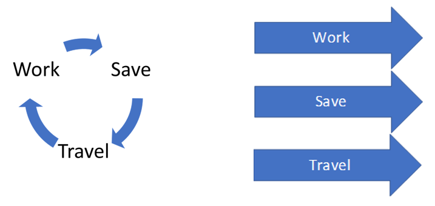
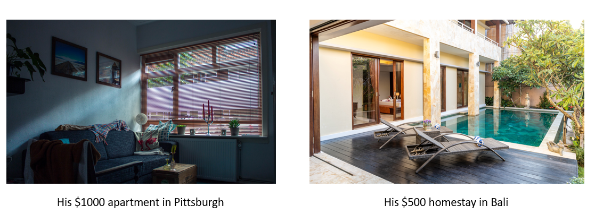
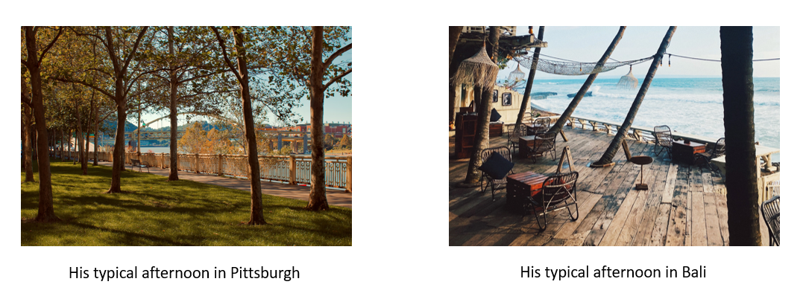

# Outline of Final Project

## Project Summary
I want to show my audience the benefits of being a digital nomad in Bali. Then I encourage them to consider becoming one.

## Project Structure
I wish to express this idea through the introduction of a fictional character (named Jack) who has the characteristic of a typical Pittsburgh citizen. I will use Jack in the story to make a comparison between his life as a regular Pittsburger and as a digital nomad in Bali.

The structure I have used here tries to adhere to the textbook, which divides it into three parts: setup, conflict, and resolution. In the setup section, I want to present the average Pittsburgh income and living expense data taht I obtained from livingcost.org. Furthermore, I do not use or process data to create a visual in the conflict section. The conflict I wish to depict is tied to general reality about Jack's monotonous life cycle (Work-Save-Travel-Repeat). Jack then found a solution to that by becoming a digital nomad in Bali, a destination he ad always longed to visit. In the resolution part, I will show a comparison of living expenses data in Pittsburgh and Bali that I got from numbeo.com. I will try to make graphs out of these comparisons. Then, at the end, I will compare Jack's life being in Pittsburgh and Bali using photographs from unsplash.com. The final structured is closed bby a call to action, particularly, "Be like Jack! Because why not?"

In the following sections, I will try to illustrate some ideas for each of the substructures I mention above.

### Setup
Jack is a 26-year-old man who presently resides and works in Pittsburgh, Pennsylvania. He has an income that is comparable to the Pittsburgh median income of $4,083.

 
He spends his monthly income on living expenses that are in line with the average in Pittsburgh: $1,048 for rent and utilities, $543 for food, and $105 for transportation. The remaining routine expenses are $2,360, which he can use toward investments, hobbies, social activities, or saving for travel.

### Conflict
During this time, Jack feels stuck in a year-long cycle of Work, Save, Travel, and Repeat. He begins to question if he could ever break free from the cycle. Can he accomplish all three things (work, save, and travel) at the same time?

### Resolution
After doing some internet research, he discovers that being a digital nomad could be one possibility. Jack finds that one of the vacation spots on his bucket list has now offered a visa for remote workers, and even better, it is tax-free. After realizing this, he seeks more information about life in Bali in comparison to Pittsburgh.

In general, he learns that the cost of living in Bali is 55.51% that of living in Pittsburgh.

Following that, he attempts to gather more extensive price comparison data for goods that are likely to become routine expenses. He notices something quite fascinating for him: if he lived in Bali, the cost of renting an apartment, which is his largest expense, could be lowered by 68.84%. Even more surprising, the cost of eating at inexpensive restaurants (which he used to do in Pittsburgh) can be decreased by 88.97%.

Overall, the differences are extremely considerable, and Jack eventually attempts to locate a new position that allows for remote work. He is willing to earn 10% less than his prior salary because the margin of living costs in Bali is expected to be just approximately 50% of what he normally spends in Pittsburgh.

After 2 months in Bali, Jack shares photos of his life in Pittsburgh and Bali, as follows:

  
  
  
  
  
  Therefore....
  
  

## Presentation Plot Plan

In my opinion, the presentation will begin with less excitement, especially when I display general info on Pittsburgh. Furthermore, the mood will continue to rise as new information concerning Bali becomes available. I believe the climax occurs at the end, when the photographs are compared.

  
  

