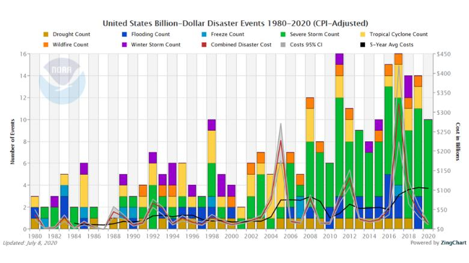
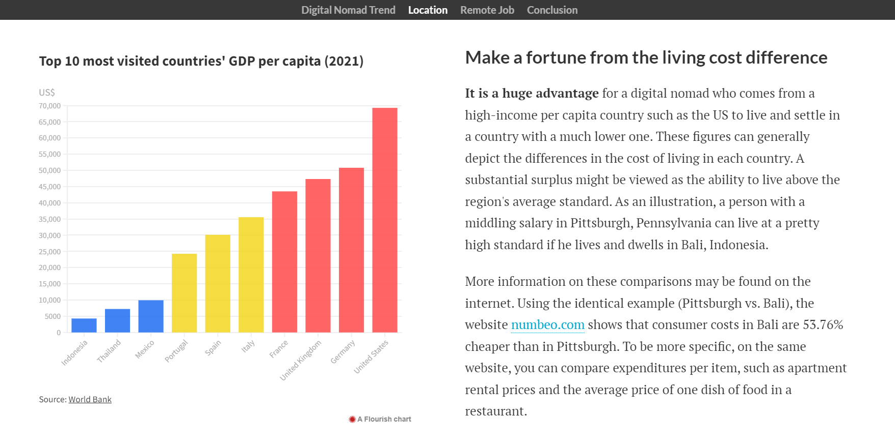
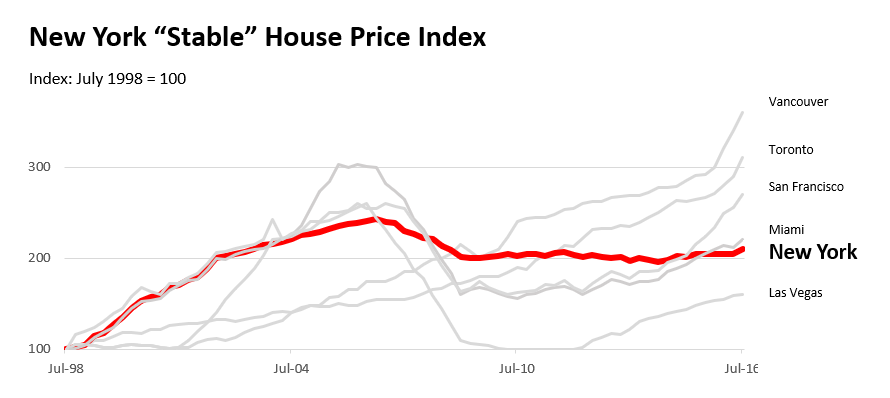
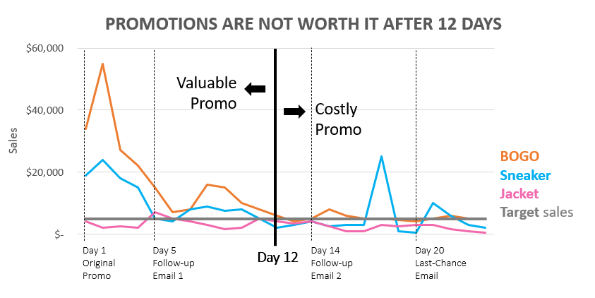

This is my public portfolio for Telling Stories with Data at CMU!

# About me
I am public employee from Indonesia who's currently leaving the job for a while to be a graduate student.

I graduated from a Public Finance College and became a civil servant in Indonesia Ministry of Finance for almost 8 years now. Having an educational background in accounting, my professional journey has revolved around the world of auditing. That, combined with my passion for the IT field, led me to many new innovations and revolutions in the internal audit itself.

The first chapter of my professional career is data engineer, a role that brought me to oversee ETL process for audit purposes. The chapters following that preamble are how I became an auditor and ended up doing research in data analytics and data governance in the Ministry of Finance. The narration of that story is dominated by how I was involved in improving the organization’s business process and culture to become adaptive to current issues and emerging technologies. However, the story is not done yet, nor reached the climax. 

The heroine of the story also had a special side quest: teaching Computer Assisted Audit Technique in training/short courses and undergraduate classes. Even though teaching classes is not always easy, nor reducing the workload as an auditor; honestly, it is actually my favorite job. Seeing students nodding in understanding is one of the best feelings I have ever had. It’s like an honest verification of me being a worthy person. 

Now that I am on leave from the hustle and bustle of being an auditor and libing a graduate student’s life at Carnegie Mellon University, I am very enthusiastic to try new things and meet new people to better equip myself for future challenges.

# What I hope to learn
As I previously stated, data covers the last few years of job experience. Of course, I've been involved in a number of projects or pieces of data visualization work. However, in performing such tasks or projects, I relied on my own intuition rather than putting forth a concentrated effort to learn data visualization.
I had a unique motive for enrolling in this Telling Stories With Data class: to prove that I knew nothing about data visualization.

# Portfolio

The following is the assignment I have done for the class:

## [Visualizing Government Debt](https://irfanradarma.github.io/94870/dataviz2)
Prof. Goranson instructed us to utilize General Debt data from the OECD website for this project. This assignment is divided up into three parts: 1) embed a visualization from the OECD website, 2) use the same data to build visualizations in Flourish, and 3) develop my own visualization in Flourish.

#### From this:

<iframe src="https://data.oecd.org/chart/6O7h" width="860" height="645" style="border: 0" mozallowfullscreen="true" webkitallowfullscreen="true" allowfullscreen="true">OECD Chart: General government debt, Total, % of GDP, Annual, 2021</iframe>

#### To this:

## [Critique by Design](https://irfanradarma.github.io/94870/critique_by_design)
In this assignment, we were asked to look for examples of poor dataviz, then critique them and rework them in accordance with the fundamentals we learned in this class.

#### From this:

  
#### To this:
  
  
<noscript></noscript><object class='tableauViz'  style='display:none;'><param name='host_url' value='https%3A%2F%2Fpublic.tableau.com%2F' /> <param name='embed_code_version' value='3' /> <param name='site_root' value='' /><param name='name' value='DisasaterFinal&#47;Sheet1' /><param name='tabs' value='no' /><param name='toolbar' value='yes' /><param name='static_image' value='https:&#47;&#47;public.tableau.com&#47;static&#47;images&#47;Di&#47;DisasaterFinal&#47;Sheet1&#47;1.png' /> <param name='animate_transition' value='yes' /><param name='display_static_image' value='yes' /><param name='display_spinner' value='yes' /><param name='display_overlay' value='yes' /><param name='display_count' value='yes' /><param name='language' value='en-US' /></object>
                

## Final Project
### [Part I: Outline](https://irfanradarma.github.io/94870/FinalProject)
This is the first part in my final project. I present a brief explanation of the project, complete with its structure, along with initial sketches. Furthermore, I give data sources as well as plans for methods and mediums for the final form.

### [Part II: Wireframe](https://irfanradarma.github.io/94870/Project_Part2)
Part II saw me doing my best to materialize the ideas established in Part I, but some of them were unable to be fulfilled since I needed to adapt the idea to the features of the platform that I would use for the final deliverable (shorthand).

### [Part III: Final Deliverable](https://irfanradarma.github.io/94870/Final_Project)
Part III closes the previous iteration by concluding the iteration process of making this project and reflecting on the 1-minute pitch that has been done to deliver this project. I made a big adjustment to the Part II in this iteration.

### Link to Final Project Deliverable
- [The Final Story Board: Even You Can Be A Digital Nomad](https://carnegiemellon.shorthandstories.com/being-a-digital-nomad/index.html)
- [Pitch Deck](https://www.canva.com/design/DAFOp_5mqgc/q19m89QAAJOKZWV43X_LmQ/view?utm_content=DAFOp_5mqgc&utm_campaign=designshare&utm_medium=link&utm_source=publishpresent)

### Snippet of the final project

## Sketching Assignment
In addition to the projects above, Professor Goranson also assigned sketching assignments every week. These assignments refer to a book by Scott Berinato entitled [Good Charts Workbook: Tips, Tools, and Exercises for Making Better Data Visualizations](https://www.goodreads.com/book/show/37956046-good-charts-workbook).

### [Controlling Color](https://irfanradarma.github.io/94870/workbook_ch1)

### [Crafting for Clarity](https://irfanradarma.github.io/94870/ch2/workbook_ch2)

### [Choosing Chart Types](https://irfanradarma.github.io/94870/ch3/workbook_ch3)

### [Practicing Persuasion](https://irfanradarma.github.io/94870/netflix/persuasion)

### Snippet of Sketching Assignment

  

