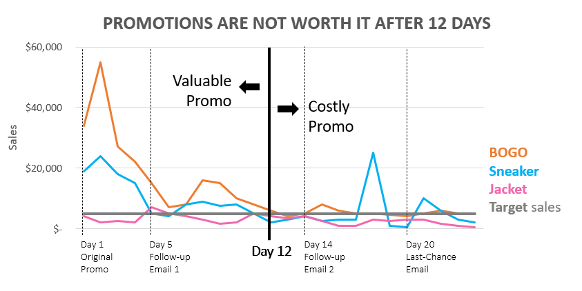

# Crafting for Clarity
## The Simple, Unclear Bar Chart
**Identify four elements of this chart that contribute to a lack of clarity.**

Here are the elements that I believe contribute to the visualization's ambiguity:

1. The title only explains the variables that exist and does not convey ideas or information that can be sought by the reader.
2. It is unclear what units the Y axis is in.
3. It is unclear what the difference between these hues implies.
4. The fact that the X-axis labels, which I believe are the anchor of information in this visualization, are presented in this manner makes it difficult for readers to read.

**Sketch a new version of it given the contextual information:**

Because the major focus is on countries with high positive deviations, I try to pick and choose which variables to use because there are too many in the previous chart. In addition, I attempted to change the title of the visualization, which relates to the conclusion, as well as the subtitle to offer more clarity. To avoid using too many colors, I arbitrarily highlight the nations with deviations of more than 30% and gray out the others.

## The Overdone Line Chart
**Identify at least two instances of redundancy and say how you’d eliminate them.**

Here are the elements that I believe are redundant:

1. The promotional impact is highlighted in two ways: by writing the promotion on the line and adding a brief description in the box.
2. These legends, in my opinion, do not need to repeat the word "promo" because the context of the promo is already expressed in the title.
3. The label on this x-axis contains the word "day", which is unnecessary because the reader understands that the digits 1 to 24 represent days.

**Identify at least three more elements that make the chart less clear than it could be.**

Here are the elements that I believe make the chart less clear:

1. Similarly to the ambiguous bar chart in the previous number, the chart title should convey a premise that may be inferred from the chart rather than simply mentioning the variables that are present.
2. The inclusion of gray boxes for this short explanation, in my opinion, makes the chart overwhelming, causing the reader's eye to roam all over the place.
3. The lines whose function is to highlight the short description box are given the same color as the variable color on the chart, which is confusing

**Sketch a clearer version that maintains focus on all three variables. Assume that the y-axis refers to dollars.**

I modified the title to provide a brief statement about the visible data. The grid lines were then simplified by removing the major vertical lines and only keeping them on promo days that needed to be highlighted. In addition, I avoid using brief explanations because it appears that the information may be acquired visually. Last touch that I did was to make the target sales line colored neutral ("black") to distinguish them with the variables.

**Sketch a version of this chart that focuses clearly on a comparison of sneaker and jacket promotions**

The minimization strategy simply follows the previous chart. What is different is the title which is aimed at the comparison of two variables. Additionally, I omitted the BOGO variable as it is irrelevant in this context.

**Sketch a version that shows the “valuable” promotion period versus the “costly” promotion period (assuming that your analysis showed that promotional activities after 12 days were not cost-beneficial).**

  
  
Apart from modifying the title to fit the occasion, I used bold vertical lines with neutral colors to indicate a cut-off date of the 12th day. In addition, an arrow denotes which is valuable and costly.

