# Choosing Cart Types
## Reflection
This chapter showed me that the type of chart to be used is determined by the objective and purpose to be addressed. By generating an aggregate comparison, you can see how significant this difference may be by simply presenting the movement from time to time. A key future lesson will be how to translate the aim of the message you want to express with data into a chart type that can portray it.

## Sketching Exercise: The Surprisingly Adaptable Line Chart

**Question 1**

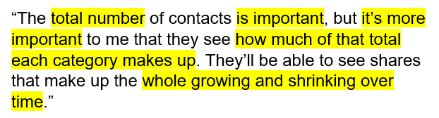

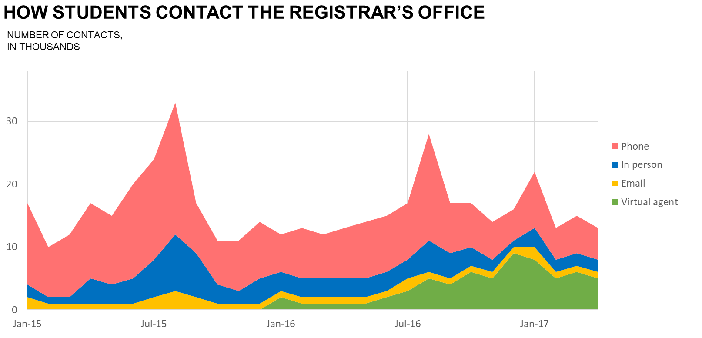

From the description above, I can understand that the most important thing is to see the movement of each variable, but not to eliminate the total information of all variables. For that, I chose to use a stacked area where the total variable is passed through the stack of each variable (not as if it were a variable on its own like the previous visual). In my opinion, one of the impressions that come from using the stacked bar is that at first glance the area that is placed on top seems to have a value that is not incremental from the area below it, but from the bottom of the x-axis. To minimize that impression, I try to sort the placement of the area (top to bottom) from the one that has the largest average value in that period. I used the colors used in the previous chart, except for the in person and virtual agent colors which I exchanged because the consequences of the ordering that I conveyed earlier would cause the red color (Phone) to be next to the green color (In person).

**Question 2**

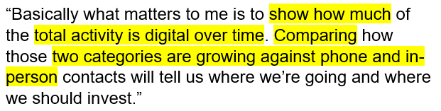
  
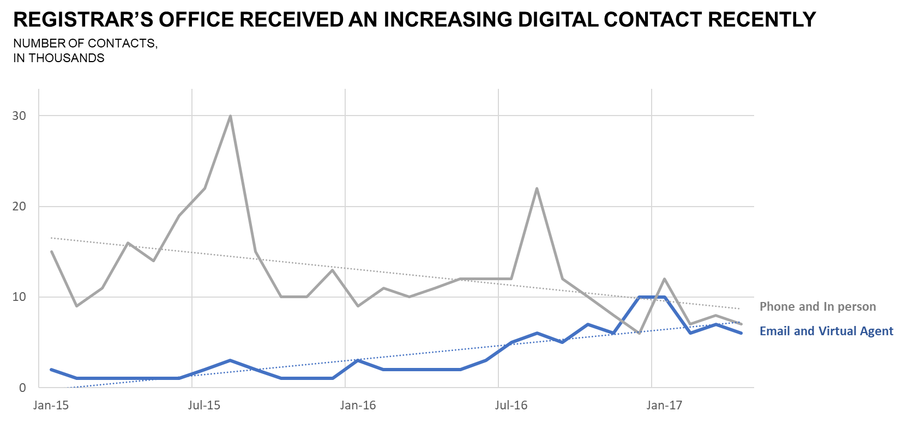
  
Here, I combine four variables into two based on the focus of the message to be presented. Because the quantity of digital activities is the variable I want to emphasize, I color it and gray out the others. To offer trend information, I specifically provide a trend line so that it is obvious that the digital variable is increasing in comparison to other variables.

**Question 3**

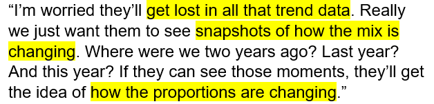

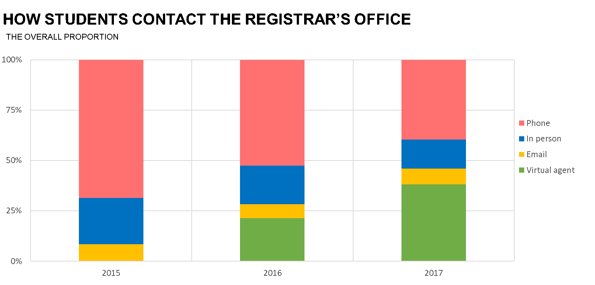

The trend of the data will be eliminated in this section, and the major attention will be on the various proportions in each year. Because the number of contacts in each year is not balanced, I opted not to utilize it on the y-axis (especially in 2017 which is only a few months). I set the 100% proportion for this so that each year it appears balanced and the proportion moves from year to year.

**Question 4**

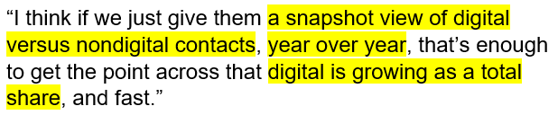
  
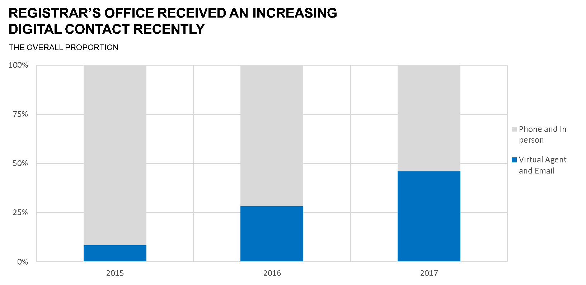

This section's concept integrates what was done in Questions 2 and 3. The division of variables, colors, and titles is the same as in Question 2. The chart type and y-axis are determined in the same way as in Question 3.

**Question 5**

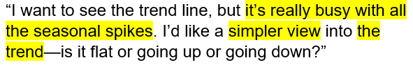

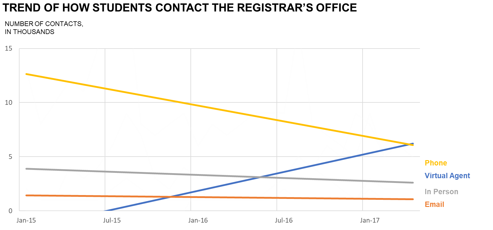

Here I convert the initial line chart into the trend line. Because I use Ms. Office, trend lines can be created automatically. The slight adjustments I made were the title and the range of the y-axis.

**Question 6**

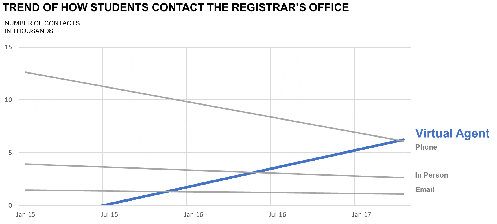
  
I made some changes to the trend chart in Question 5 by greying out all variables except the Virtual Agent. Aside from that, I made the virtual agent line bold and increased the size of the legend to make it stand out more.
