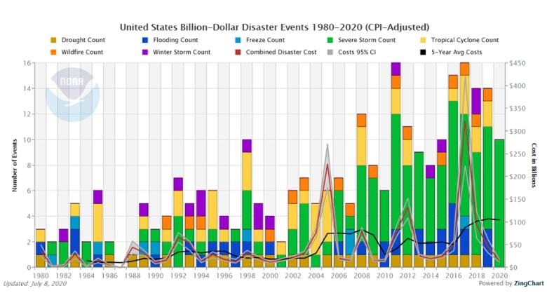

# Critique By Design
by Irfan Radarma

This graph was taken from CNN's website and is headlined "[US hits 10th billion-dollar weather disaster of the year - at a record pace](https://www.cnn.com/2020/07/12/weather/billion-dollar-weather-disasters-2020/index.html)". The graph was obtained from the website of the [National Centers for Environmental Information](https://www.ncei.noaa.gov/access/billions/summary-stats/US/2020) (embedded). The following is a narrative excerpt to provide an overview of the news context in which the graph is used: "Since 1980, the US has averaged close to seven billion-dollar weather disasters annually. But the last five years have seen nearly 14 severe storms on average. There will be more this year if the current pace continues, according to NOAA."

## Critique

### First Impression
When I initially looked at the graph, I noticed a lot of colors represented in small forms. The bright bar charts superimposed with colorful lines irritate me. Furthermore, the grid line makes it difficult for me to understand what the graph means. In a nutshell, it's really packed!

### Not a very helpful title
The graph already has a title, but reading it doesn't immediately assist me comprehend the context of the data being displayed. After more inspection, I discovered that this title is the default of the graphic included from the National Centers for Environmental Information website. Because the title is broad and impartial, it is understandable that it does not lead to a story. However, in the context of this news, the headline is not a reader's best buddy.

### What exactly is this legend about?
The legend underneath the title is made up of ten colors/components. I'm a little concerned based on the numbers; it appears that there are too many components for readers to keep track of. Something felt incorrect after I examined each of the components in the legend. The elements in the legend are not comparable variables. What I understand is that there are seven different types of disasters, one component is a composite of the seven different types of disasters, and the remaining two are statistical variables like confidence interval and a five-year average. These legends are then linked to the shapes used in the main section of the visualization, which is a separate issue that I'll go into in more detail later.

At first glance, this legend leads the reader to assume that there are ten different types of disasters to compare, which is not the case because there are only seven. Maybe it's best to separate the location, or if it must stay there at least alter the emblem to something other than square. This emphasizes the discrepancy, because the three additional components are not represented by a bar chart in the visualization section. So, a quick adjustment could be to convert the symbols "combined disaster cost," "cost 95% CI," and "5-year average cost" to lines. However, this is only if the component is to be retained in this graph.

### Overcrowded
Let me recap the major component of the visualization: there are 10 colors represented by 7 color grid diagrams and 3 color lines that are stacked on top of each other. It is also worth noting that the total line is four since the variable confidence interval is divided into two lines, which I discovered after examining more attentively while frowning, indicating how difficult it is to see the components in this graph. The usage of vertical grid lines exacerbates the high number of colors and shapes used. There doesn't seem to be any empty space there, and there seems to be so much going on in that one box that it's difficult to focus on just on or a few.

The number of data points on this graph alone is 'astounding', around 40s. That number is not the main reason I believe this graph is overcrowded, but the 40 plus 7 colors on the bar chart have given me a yellow signal. The good news is that the placement of the seven colors on the bar chart is fairly consistent, with purple (Winter Storm Count) at the top and dark yellow (Drought Count) at the bottom. The yellow signal then become a red alert when determining why there should be a line over the bar charts. There are also four lines of three distinct hues. There are simply too many!

### Context Analysis
What I understand is that the graph contains at least two main contexts, as shown by the presence of two y axes (number of events and cost in billions). In general, the article would like to point out that at the time of writing (mid-2020), the number of billion-dollar disaster events had reached an all-time high. Other graphics in the article can effectively support the narrative, as follows:

  
However, in the following explanation, the article addresses disaster incidents in specific places and shows a graph that I criticize on this occasion. To recapitulate, this graph is meant to detail disaster events by year. If such is the case, the information "number of events" appears to be more essential, whereas "cost in billions" appears to be unnecessary in this visualization. In my upcoming redesign attempts, I will apply that context assumptions.

## Solution Sketch

<noscript></noscript><object class='tableauViz'  style='display:none;'><param name='host_url' value='https%3A%2F%2Fpublic.tableau.com%2F' /> <param name='embed_code_version' value='3' /> <param name='site_root' value='' /><param name='name' value='Disaster_16636224689470&#47;Sheet1' /><param name='tabs' value='no' /><param name='toolbar' value='yes' /><param name='static_image' value='https:&#47;&#47;public.tableau.com&#47;static&#47;images&#47;Di&#47;Disaster_16636224689470&#47;Sheet1&#47;1.png' /> <param name='animate_transition' value='yes' /><param name='display_static_image' value='yes' /><param name='display_spinner' value='yes' /><param name='display_overlay' value='yes' /><param name='display_count' value='yes' /><param name='language' value='en-US' /></object>
                

Here are the adjustments I'm trying to apply to the previous graph:
1. I changed the title, which was previously very general and open to more segmentation, so that readers have an initial idea before looking at the graph.
2. Assuming that the relevant context is the alarming number of events in 2020, I omitted the cost information previously represented by the y axis that at the resulted in the use of lines for the statistics (lines) variables.
3. For color, I opted to emphasize severe storms, which, based on the trend, are becoming more frequent; even in 2020 data, there are only severe storms. I accent it with a red color that provides the appearance of being alarming. Furthermore, I give the other variables a very soft tint variation so that they do not distract the variables I select to highlight, but still can be identified from one another because I choose to keep the 7 disaster variables on this graph.
4. I'm annotating the 2020 data because the CNN article was written in the middle of the year (July), so the author's perspective that I'm attempting to approximate is that while the 2020 total is not greater than 2019, it is only the first half of 2020 and there is a possibility that the numbers will continue to grow in the second half of 2020. The annotation supports this, also for the readers of this graph for the purposes of my current assignment so as not to mistake it for one year 2020 data.

## Feedback
I have two evaluators to test my sketch. I used different method for them to evaluate it.

### First evaluator (grad student, 20s)
I directly asked the first evaluator for his opinion by displaying my public tableau graph. I tried to demonstrate this test in two parts: first, I asked him to look at this graph for 15 seconds and then had some questions for him to answer. The second part is that I gave him as much time as he desired before asking for his opinion again. The following is a summary of these evaluation:

#### First glance
*Can you catch what the graph is telling you? Please elaborate*
> I needed time to process what was concerning about 2020 at the time. I was wondering what the meaning and correlation of 2020 in the title and 1st half 2020 on the box were. Looking at the box, 2020 is not the highest compared to previous years' data. What is the point of making this graph if the data for 2020 is not higher than it was in previous years? I then begun to realize that the data for 2020 may only be half a year, unlike the previous years, which had full year data.

*Do you feel overwhelmed by the visual? Do you remember anything stands out from the visual?*
> Not really. That was a pretty typical bar graph. I remember the red square with the "1st half of 2020" caught my eyes instantly. But again, I was a little bit confused when comparing it with the title. 

#### Second look
This second part of test took about 1-2 minutes before the evaluator said he's done observing the graph. The following is the summary of second evaluation:

*Would you like to clarify or correct your opinion at the previous first glance?*
> It seems that what I said earlier is not much different from what I caught in this second look. So, my previous opinion is still valid.

*What do you think is bad about the graph?*
> In general, I have no issues to this type of visualization. I also have no issues with the color scheme, as it appeared to be done on purpose to showcase the red one. I brought up the "first half of 2020" box in the middle again, which I found bothersome. I understand that there needs to be a stronger emphasis on the fact that the 2020 data is not a one-year snapshot. However, your method does not appear to be the best.

*Any concrete suggestions to improve what you think is not good enough?*
> There are several things that come to mind: one, maybe the title of the graph can explain more explicitly about the first half of 2020. Two, the red box in the middle can be clarified again, don't make it too short and become like a puzzle. The last one, may be able to give a certain accent to the 2020 block which indicates that it is only half year data.

### Second evaluator (public employee, 30s)
For the second evaluator, the method used is different, not directly. I did not meet in person, but sent my graphic images accompanied by questions. The following is a summary of his response. I did not meet him in person, but instead provided my explicit images digitally along with questions, without giving him any context about the graph. This is a summary of his response.

*Can you describe what the graph is telling you?*
> The graph that shows the number of times several disasters occured over the span of 40 years between 19800 and 2020.

*Is there anything you find surprising or confusing?*
> I find this graph to be normal looking, nothing out of ordinary.

*Who do you think is the intended audience for this?*
> The graph might be generated to give insight for people who are in charge of disaster relief and/or prevention in a particular area, so that those people can prepare for disasters that may occur in the future based on the information in the graph.

*Is there anything you would change or do differently?*
> I would probably add the name of the area where this graph is based on the title of the graph so that the viewers can tell where these disasters happened.

## Takeaways from the two sources
According to the responses I received, they both responded quite differently. The first evaluator was more elaborative since our conversation seemed to flow smoothly when we met in person. The second person, on the other hand, responded to my query more directly. Because of this, as well as the fact that he was unaware of the context of the news, he mainly responded in brief sentences. However, there are certain similarities between the two points of view as follows:
> The absence of anything dazzling or distracting from its visual look. Both consider this graph to be ordinary/typical.
>> One of my main goals after seeing and criticizing the previous graph was to reduce the presentation, which I believed was too dense, and it appeared to work. However, it is possible that I oversimplified the graph so that it does not appear attractive at first glance.

There is no difference of viewpoint between the two, as far as I can tell from their responses. What exists is that each mentions something different, hence they do not contradict each other. Among the suggestions and responses (implicit feedback), especially those related to increased clarity of the 2020 data, these are the improvement I would make for the next iteration process:
> - Be more explicit in title about the first half of 2020
> - Thicken the title text with the expectation that readers will start looking from the title
> - Remove the red square in the middle that was previously used to denote the first half of 2020
> - Add a subtitle stating the data cut-off
> - Add an extra accent to the 2020 data block

I did not use the second evaluator's feedback for improvement this time since I believed it stemmed from his lack of knowledge of the news context. For example, the addition of the name of the location where the disaster occurred was not even indicated in the previous visualization, and the data source do not provide this detail either. CNN, on the other hand, discussed this location-related topic in its explanatory paragraphs. So in my opinion, because this graph was originally an integral part of the news article, feedback related to the location can be placed outside the graph alone.

## The first iteration of recreating solution

<noscript></noscript><object class='tableauViz'  style='display:none;'><param name='host_url' value='https%3A%2F%2Fpublic.tableau.com%2F' /> <param name='embed_code_version' value='3' /> <param name='site_root' value='' /><param name='name' value='Disasater&#47;Sheet1' /><param name='tabs' value='no' /><param name='toolbar' value='yes' /><param name='static_image' value='https:&#47;&#47;public.tableau.com&#47;static&#47;images&#47;Di&#47;Disasater&#47;Sheet1&#47;1.png' /> <param name='animate_transition' value='yes' /><param name='display_static_image' value='yes' /><param name='display_spinner' value='yes' /><param name='display_overlay' value='yes' /><param name='display_count' value='yes' /><param name='language' value='en-US' /></object>
                

## The second iteration (in-class critique)
In the last iteration, I got some very good feedback from classmates. Here are the ideas I am willing to implement in to improve my graph:
> - Despite agreeing with the idea to make one color stands out among the other, the position of red bar appears to be wiggling up and down. It would be better if the red bars are applied at the bottom so it does not look wobbly.
> - Because not all readers begin by reading the title, the red box that was previously in the center (1st half 2020) is really quite helpful in directing readers. So it's best to put it back, but make it less conspicuous.
> - The text box used to explain the first half of 2020 should be made somewhat transparent so that it does not block the bar graph.

<noscript></noscript><object class='tableauViz'  style='display:none;'><param name='host_url' value='https%3A%2F%2Fpublic.tableau.com%2F' /> <param name='embed_code_version' value='3' /> <param name='site_root' value='' /><param name='name' value='DisasaterFinal&#47;Sheet1' /><param name='tabs' value='no' /><param name='toolbar' value='yes' /><param name='static_image' value='https:&#47;&#47;public.tableau.com&#47;static&#47;images&#47;Di&#47;DisasaterFinal&#47;Sheet1&#47;1.png' /> <param name='animate_transition' value='yes' /><param name='display_static_image' value='yes' /><param name='display_spinner' value='yes' /><param name='display_overlay' value='yes' /><param name='display_count' value='yes' /><param name='language' value='en-US' /></object>
                

