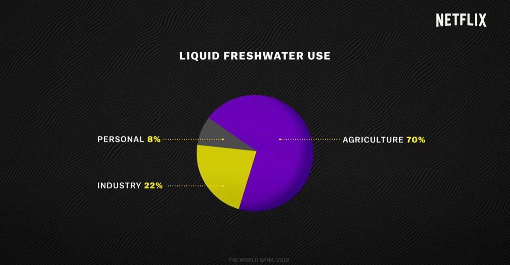
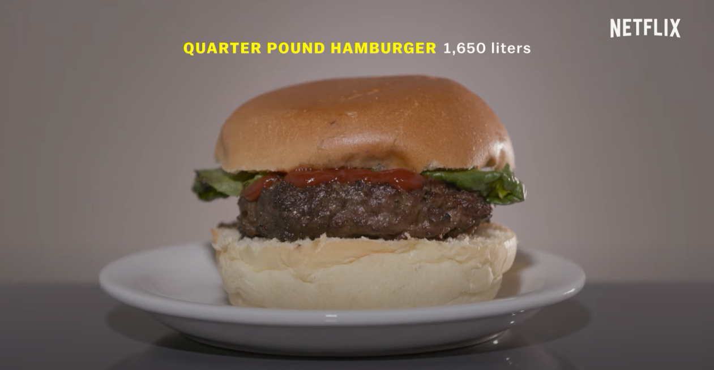

# Explained | World's Water Crisis

## Setup
A good approach for explaining overall water conditions on Earth. The information to be discussed here is how, despite the fact that the world is a blue planet with a lot of water, the majority of it is water that cannot be consumed. The comparison picture, in my opinion, is highly successful in stressing how scarce liquid freshwater is as a natural resource on this planet.

The video illustrates (using the following chart), from a tiny point that stresses the limited availability of fresh water, that the majority of that tiny one percent cannot be easily accessed by people due to their underground location. I would say this is a good example of transitioning from general to more specific data.

The following chart, in my opinion, is the end of the setup where the film begins to narrow down that from the limited quantity of accessible fresh water, agriculture and industry exploit the majority of it. Overall, the graphics displayed in this setup are great because they relate to each other. Remember, from general conditions on earth, it is narrowed down to 1% supply, narrowed again because not everything is accessible, and this pie chart explains who/what activities are the main exploiters. Nice sequences.

  
  
## Conflict
The conflict that I perceive from the video is one in which modern humans' actions have undermined the supply of fresh water. Continuing the agriculture sector's excessive reliance on water, the video uses a familiar object, burgers, to demonstrate how much water this one basic product requires. The use of objects that are relevant to a wide audience is a very good strategy. In this way, the audience can better understand the paradox inwardly.

The discussion of the conflict is then generalized to a wider subject where meat consumption (which was previously described as very water-intensive in the process) has an increasing trend. This status quo is the angle the video emphasizes and this chart simply depicts it.

Furthermore, numerous issues are portrayed through audiovisuals, such as the Colorado River's heavy consumption of water, which causes the river's mouth in Mexico to dry up. So far, water has been commonly seen as a "free" natural resource, resulting in widespread exploitation. The narration is then utilized to discuss the video's resolution.

## Resolution
In general, the video's message is to reconsider the "cost" of water in human life. Attempting to solve the problem of the perception that water is "free," this film attempts to transmit solutions, such as raising human knowledge that water is very important and the supply is limited, thus it must be preserved, at least in terms of use. This movie presents South Africa as a success story for increasing awareness of the water situation, which was previously anticipated to be the first city to undergo a severe drought, dubbed "day zero." The bar chart below tells the success story of the solution narrated in the video.

Furthermore, the film concludes with several calls to action, but the emphasis is on how humans should value water more highly so that they do not overconsume it.

