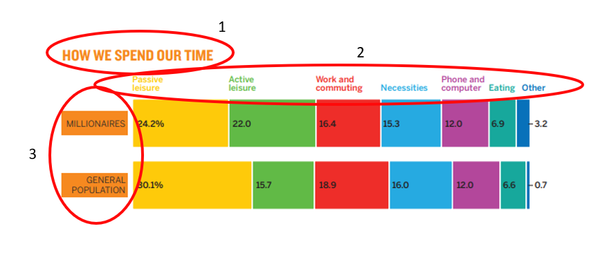
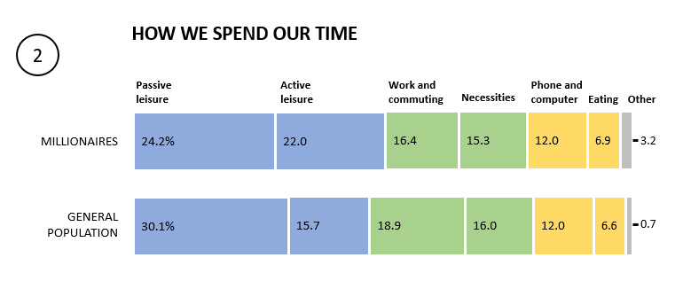
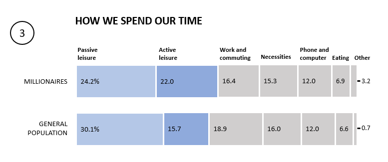
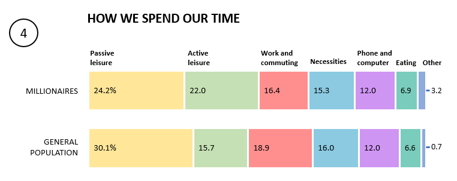
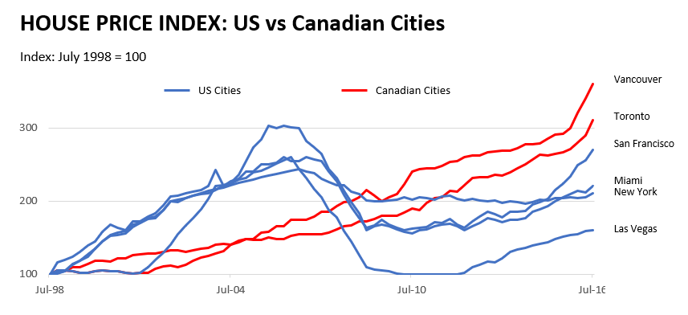
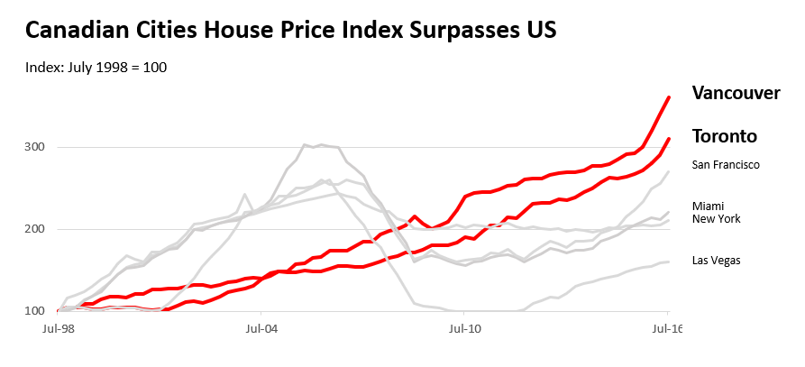
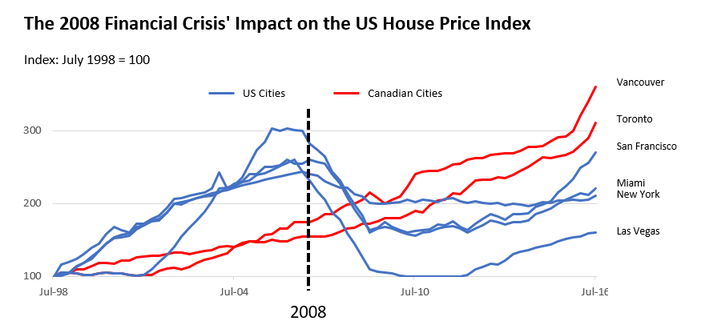

# Controlling Color
## Reflection
A quick reflection on the lessons in chapter one for myself is to try to minimize the use of colors and variables. Furthermore, in constructing the visualization, as much as feasible, the aesthetics to the general audience are neutralized, for example, the location of the variable sequence is sorted based on generally known characteristics. In addition, it is important to put a certain emphasis on the design in accordance with the main message to be conveyed to the reader. Finally, I like this catchy phrase in chapter one: "just because the software does it a certain way doesn't mean you have to."

## Sketching Exercise
### The Rainbow Bars
**Find up to three places you can remove color regardless of context.**

Three components I think do not need distinctive hues are the title, x-axis titles, and y-axis titles.

**Find a way to group the variables using fewer colors but maintaining useful distinctions.**

Here I use 3 different colors and 1 neutral color for others. I grouped every two things into one color because I think there are similarities between them. In the choice of colors, this may also explain my color selection in the next explanation, I like to choose colors that are a bit soft so it doesn't make the reader's eyes tired.

**You want to discuss leisure time with your audience. Create a color scheme for this context.**

My strategy or approach here is quite simple, giving color to leisure (which is the message I want to convey), and neutralizing the others to gray. I give a thicker color to active leisure in the hope that readers can distinguish it from passive one.

**Find a way to maintain seven colors without creating an overwhelming rainbow effect.**

If I had to stick with the seven colors in the example, I would make them softer so they don't really stand out.

### The Tangled Lines
*disclaimer: I did not use the real data to recreate this chart. Instead, I randomized data that would create a similar pattern to the original one.*

**Create a logical grouping of variables and a color scheme for the grouping.**

The logical grouping that I made is to divide it into Canadian Cities and US Cities. I colored Canadian red because it's the dominant color on the Canadian flag, and blue in the US because the US is often represented by red and blue (I didn't use red because it's been used for Canada). I changed the title so that it better represents the color divisions I made on the chart. I also deleted the color markers from the legend (as used in the example).

**Create a color scheme that helps your audience focus on Canadian housing prices.**

The coloring strategy is the same as before, assigning a color to the variable I want to emphasize and assigning a neutral color (grey) to the other variables. In addition, here I give additional accents on the Vancouver and Toronto lines and labels (bolder/thicker lines and font with a larger size label). The title is also customized.

**Create two more versions of this chart that use color to focus on trends in the data.**

In this first example, I repeat the strategy or approach I took earlier here, but with a different example of emphasizing information. The narrative I'm trying to prepare from this visualization is how the New York index has been quite stable in recent years, especially compared to other big cities in North America.

In the second example, I tried to give a vertical line with a neutral color (black) which indicates the declining trend of US cities. One possible story to tell with this data is that the index of major US cities has generally declined after 2007-2008. This also indicates that the 2008 crisis is very close to the issue of an economic bubble in the property sector.

